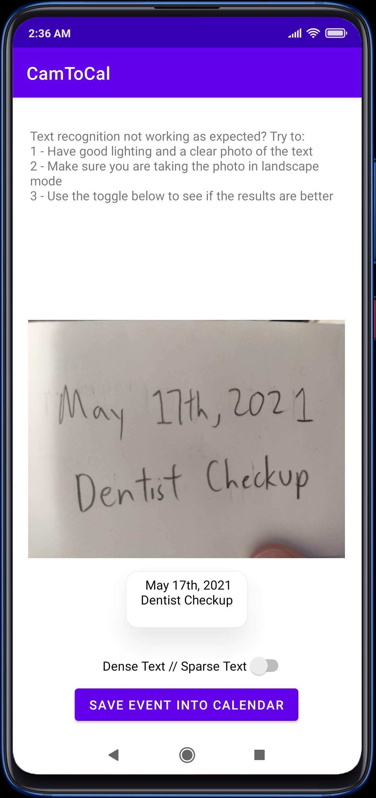
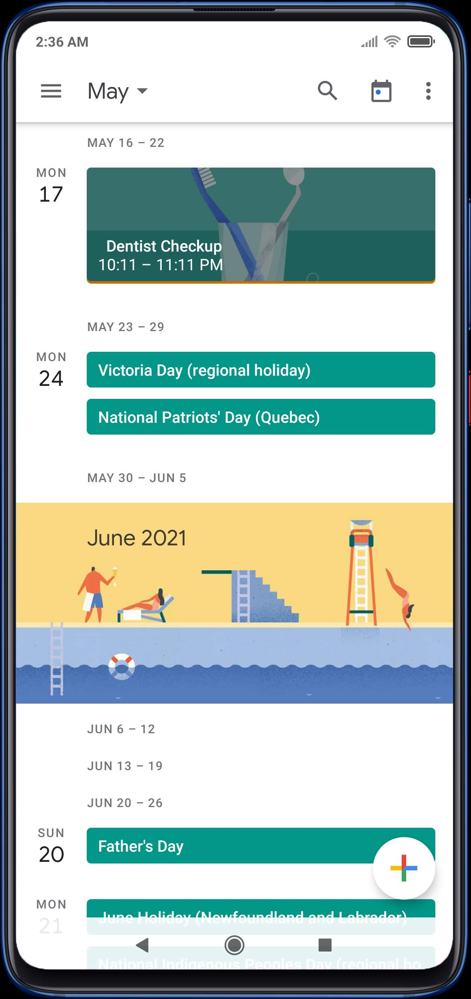

<h1 align="center">CamToCal</h1>

  

## Overview

Android Application that takes and automatically exports your physical agenda into Google Calendar.

Feel free to try the app on the [release page!](https://github.com/K-zhao/CamToCal/releases/)

**The app is currently in alpha state. Things WILL BREAK!**

  
  

## Features
- **Add Events in English into Google Calendar**
- **Can take photos from app, or pick previously taken photos**
- **Preview text recognition for accuracy before adding event to calendar**
  - Can toggle text recognition models for potentially more accurate readings

## Technologies Used
- **Android - Java**
- **Firebase - Machine Learning - Text Recognition API**

## Limitations
**The app currently does not support other languages, or multiple events and times in a single photo.
This may be implemented in future iterations.**

